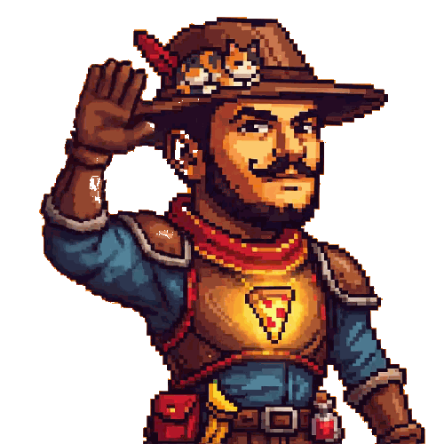

  
   
  &nbsp;&nbsp;&nbsp;&nbsp;&nbsp;&nbsp;&nbsp;&nbsp;<strong>Hi, I'm Moaz</strong>
   
  <strong>Follow me and stick around, I'm always building something new.</strong>

High-ownership engineer. I architect and build AI agent systems - multi-agent orchestration, workflows, and production-grade automation that ships real software faster.

## Current Projects

- [🚀 New] [👀 Stealth] **ProClaw** - Enterprise-grade Claws: team management, guided setup wizards, and live dashboards.
 

- ⚡️ [**CodeMachine**](https://github.com/moazbuilds/CodeMachine-CLI) - Orchestrates AI coding agents into repeatable, long-running workflows.
- 🐾 [**ClaudeClaw**](https://github.com/moazbuilds/claudeclaw) - A lightweight OpenClaw version built into your Claude Code.

### Workflows/Skills

- ✍️ [**Pragma**](https://github.com/moazbuilds/pragma-post-writer) - Pragma is a modular AI skill and workflow that challenges your thinking, sharpens your angle, and helps you write publish-ready content for social media, blogs, and forums.
- 🔍 [**Reframe**](https://github.com/moazbuilds/reframe) - A structured, Nobel Prize-based problem-solving workflow that helps you find the real problem before solving it.
